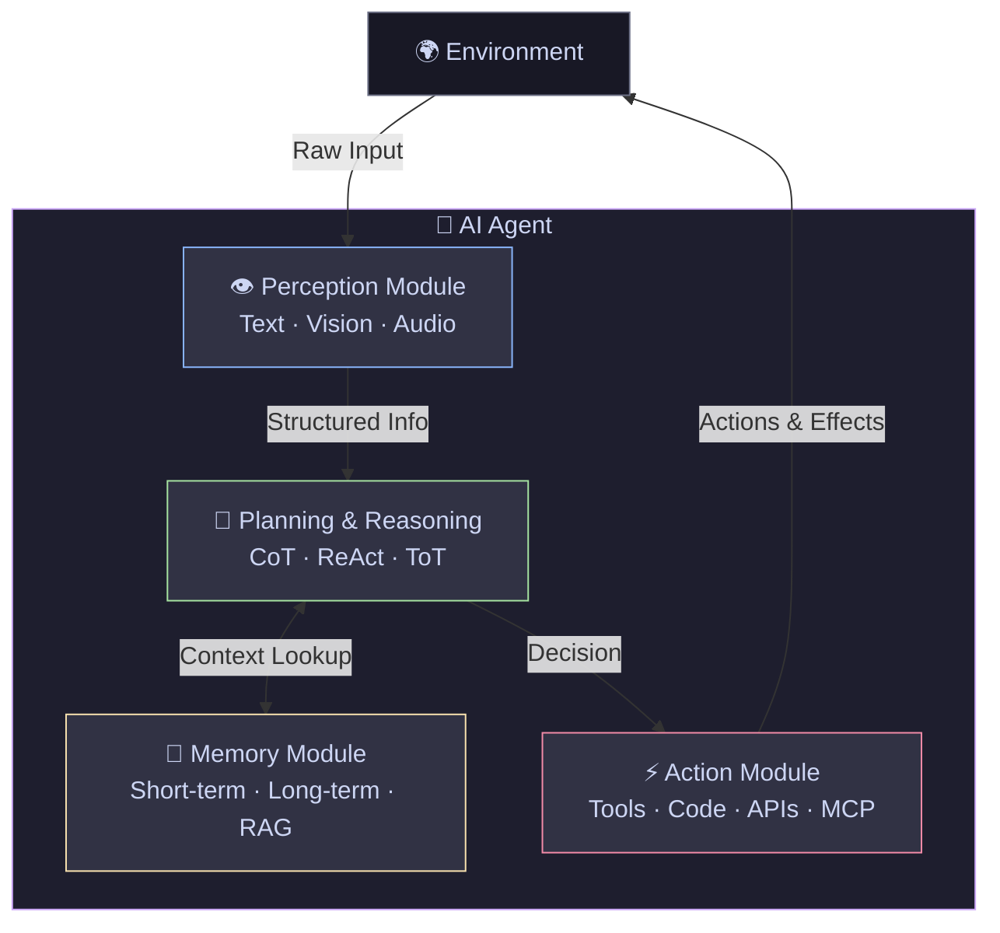
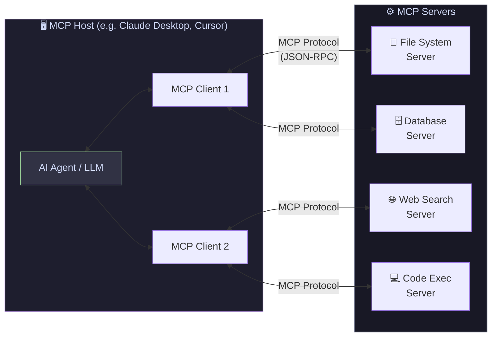
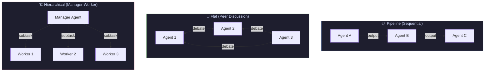

# AI-Agent-Guide

[English](README_EN.md) | [中文](README.md)

[](https://github.com/Scodive/AI-Agent-Guide/stargazers)
[](https://github.com/Scodive/AI-Agent-Guide/commits/main)
[](https://github.com/Scodive/AI-Agent-Guide/blob/main/CONTRIBUTING.md)
[](https://github.com/Scodive/AI-Agent-Guide/blob/main/LICENSE)
[](https://awesome.re)

Welcome to **AI-Agent-Guide**! This repository aims to provide researchers, developers, and enthusiasts with a comprehensive, authoritative, and continuously updated guide to AI Agents. As artificial intelligence evolves from a passive text generation tool to an active entity capable of perceiving, planning, remembering, and acting, a brand new **"Agentic Era"** has arrived. This guide systematically dissects the core architecture of AI agents, surveys key technologies, and provides curated academic papers and open-source repositories to help you deeply understand and build next-generation intelligent applications.

All cited papers and repositories are authentic and verifiable, providing a solid foundation for learning and research in this field.

---

## Table of Contents

- [Foundational Overviews & Surveys](#foundational-overviews--surveys)
  - [General Agent Surveys](#general-agent-surveys)
  - [Domain-Specific Application Surveys](#domain-specific-application-surveys)
  - [Foundation Models & Decision Making Surveys](#foundation-models--decision-making-surveys)
- [Anatomy of AI Agents: Core Architecture Blueprint](#anatomy-of-ai-agents-core-architecture-blueprint)
- [Perception Module: Perceiving Digital and Physical Worlds](#perception-module-perceiving-digital-and-physical-worlds)
  - [Text Perception](#text-perception)
  - [Multimodal Perception & GUI Agents](#multimodal-perception--gui-agents)
  - [Core Tech: Vision-Language Models (VLMs)](#core-tech-vision-language-models-vlms)
  - [Key Challenges](#key-challenges)
  - [Related Papers & Resources](#related-papers--resources)
- [Planning & Reasoning Module: The Cognitive Core of Agents](#planning--reasoning-module-the-cognitive-core-of-agents)
  - [Base Reasoning Tech Evolution](#base-reasoning-tech-evolution)
  - [Reasoning Tech Comparisons](#reasoning-tech-comparisons)
- [Memory Module: Enabling Learning and Context Awareness](#memory-module-enabling-learning-and-context-awareness)
  - [Memory Architecture](#memory-architecture)
  - [Core Mechanisms for Long-Term Memory](#core-mechanisms-for-long-term-memory)
  - [Related Papers & Resources](#related-papers--resources-1)
- [Action Module: Executing Tasks and Using Tools](#action-module-executing-tasks-and-using-tools)
  - [Tool Use Paradigms](#tool-use-paradigms)
  - [Tool Creation Paradigms](#tool-creation-paradigms)
  - [MCP: Model Context Protocol](#mcp-model-context-protocol)
  - [Related Papers & Resources](#related-papers--resources-2)
- [Agentic Coding: The Software Engineering Frontier](#agentic-coding-the-software-engineering-frontier)
  - [Key Systems & Benchmarks](#key-systems--benchmarks)
  - [Related Papers & Resources](#related-papers--resources-3)
- [Agent Development Frameworks: From Theory to Practice](#agent-development-frameworks-from-theory-to-practice)
  - [Deep Dive into Mainstream Frameworks](#deep-dive-into-mainstream-frameworks)
  - [Framework Comparisons](#framework-comparisons)
  - [Practice: Paper-Agent-Skills](#practice-paper-agent-skills)
- [Multi-Agent Systems (MAS): Emergent Intelligence through Collaboration](#multi-agent-systems-mas-emergent-intelligence-through-collaboration)
  - [MAS Paradigm & Architectures](#mas-paradigm--architectures)
  - [Typical Applications](#typical-applications)
  - [Key Challenges](#key-challenges-1)
  - [Related Papers & Resources](#related-papers--resources-4)
- [Trustworthiness: Safety, Alignment, and Evaluation](#trustworthiness-safety-alignment-and-evaluation)
  - [Alignment Methodologies](#alignment-methodologies)
  - [Evaluation & Benchmarks](#evaluation--benchmarks)
  - [Related Papers & Resources](#related-papers--resources-5)
- [2025–2026 Top Conference Highlights](#20252026-top-conference-highlights)
- [How to Contribute](#how-to-contribute)
- [Citation](#citation)

---

## Foundational Overviews & Surveys

For any researcher looking to dive into the field of AI agents, starting with authoritative survey papers is essential. These documents provide a macro perspective, core concept definitions, and systematic technology classifications, serving as the cornerstone for building a knowledge framework. This section highlights high-quality survey papers covering topics from general agent architectures to specific domain applications.

### General Agent Surveys

- **A Survey on Large Language Model based Autonomous Agents** (Wang et al., 2023)

  This paper proposes a holistic framework for LLM-driven autonomous agents, systematically surveying existing research across three dimensions: construction, application, and evaluation. The proposed agent architecture (profile, memory, planning, and action modules) has become a widely-cited standard model in the field.

  [arXiv: 2308.11432](https://arxiv.org/abs/2308.11432)

- **Large Language Model Agent: A Survey on Methodology, Applications and Challenges** (Luo et al., 2025)

  This methodology-centric survey systematically deconstructs LLM agent systems, exploring architectural foundations, collaboration mechanisms, and evolution paths of agents. It unifies fragmented research threads and reveals connections between agent design principles and their emergent behaviors in complex environments.

  [arXiv: 2503.21460](https://arxiv.org/abs/2503.21460) / [GitHub](https://github.com/luo-junyu/Awesome-Agent-Papers)

- **Agentic Large Language Models, a Survey** (Plaat et al., 2025)

  This survey categorizes the core capabilities of Agentic LLMs into three aspects: reasoning, acting, and interacting. It clearly illustrates how different research domains reinforce one another—information retrieval empowers tool utilization, and reflection mechanisms enhance multi-agent collaboration.

  [arXiv: 2503.23037](https://arxiv.org/abs/2503.23037) / [Website](https://askeplaat.github.io/agentic-llm-survey-site/)

### Domain-Specific Application Surveys

- **A Survey of Large Language Model Agents for Question Answering** (2025)

  Focusing on agents in Question Answering tasks, this paper reviews LLM agent design covering planning, question comprehension, information retrieval, and answer generation, while discussing current challenges and future research directions.

  [arXiv: 2503.19213](https://arxiv.org/abs/2503.19213)

- **A Survey of Large Language Model Empowered Agents for Recommendation and Search** (Zhang et al., 2025)

  Explores the transformative potential of LLM agents in enhancing recommendation systems and search engines, offering the first systematic review and classification of LLM agent research in information retrieval.

  [arXiv: 2503.05659](https://arxiv.org/abs/2503.05659)

- **Large Language Model-based Data Science Agent: A Survey** (Wang et al., 2025)

  Comprehensively analyzes LLM agents designed for data science tasks, bridging general agent design principles with practical data science workflows (data preprocessing, model development, evaluation, and visualization).

  [arXiv: 2508.02744](https://arxiv.org/abs/2508.02744)

### Foundation Models & Decision Making Surveys

- **Foundation Models for Decision Making: Problems, Methods, and Opportunities** (Yang et al., 2023)

  Explores the application of foundation models in the broader field of decision-making, providing essential context for understanding agent behavior. Reviews how foundation models can be used in practical decision tasks through prompting, generative modeling, planning, optimal control, and reinforcement learning.

  [arXiv: 2303.04129](https://arxiv.org/abs/2303.04129)

---

## Anatomy of AI Agents: Core Architecture Blueprint

To understand AI agents systematically, we need a clear architectural blueprint. Although specific implementations vary, most LLM-based single-agent systems can be deconstructed into a unified framework comprising **four core modules**. This framework, proposed by Wang et al. (2023), provides a universal model for analyzing and constructing agents.

The LLM acts as the "brain" or central processor, coordinating the different modules and leveraging its powerful language understanding and reasoning capabilities to drive the entire system.



The four core modules are:

- **Perception Module**: The entry point for environmental interaction. Receives and processes raw information—user instructions, API responses, webpage screenshots—transforming it into structured representations the agent can understand.

- **Planning & Reasoning Module**: The cognitive core. Receives processed information and conducts reasoning based on goals, breaking down complex objectives into specific, executable steps or subtasks.

- **Memory Module**: Enables learning and adaptation. Stores and retrieves information including short-term memory (current conversation context) and long-term memory (past experiences, user preferences, knowledge bases).

- **Action Module**: Translates planning decisions into actual environmental interactions by invoking external tools (code interpreters, search APIs, databases), enabling the agent to access real-time information and execute tasks.

Information flows in a dynamic cycle: Perception → Planning (with Memory) → Action → Environment → Perception, repeating until the task is complete.

### Architecture Blueprint — Key Papers

- **Cognitive Architectures for Language Agents (CoALA)** (Sumers et al., 2023)

  Deeply integrates modern LLMs with classic cognitive science architectures (ACT-R, SOAR) to construct the highly influential CoALA standard. Rigorously defines the cyclical relationship between "internal actions" (procedure/memory modules) and the "external environment," deepening the theoretical foundation of general agent architecture design.

  [arXiv: 2309.02427](https://arxiv.org/abs/2309.02427)

- **OpenAgents: An Open Platform for Language Agents in the Wild** (Xie et al., 2023)

  Explores a unified design model from an engineering implementation perspective. Uses a highly standardized perception-planning-memory-execution framework to simultaneously incubate three complex specialized agent systems (data analysis, plugin, and web agents). A quintessential system engineering achievement validating complex multimodal modular architectures.

  [arXiv: 2310.10634](https://arxiv.org/abs/2310.10634) / [GitHub](https://github.com/xlang-ai/OpenAgents)

---

## Perception Module: Perceiving Digital and Physical Worlds

Perception is the bridge connecting agents to the world, and the foundation for all subsequent thinking and action. This module receives raw data from the environment and transforms it into structured information that the planning module can understand and utilize. The sophistication of perception capabilities directly determines the complexity of environments in which an agent can effectively operate.

### Text Perception

The most fundamental form of perception: agents understand their tasks and environment by processing pure text input. These inputs can come from many sources—user natural language instructions, document content read from files, or text results returned from API calls.

### Multimodal Perception & GUI Agents

As agent application scenarios expand from pure-text environments to graphical user interfaces (GUIs), web pages, and even the physical world, multimodal perception has become critical. It enables agents to "see" and understand visual information, allowing them to interact with systems designed for humans.

**Computer Use** represents a major frontier: agents that can directly control any application on a computer screen—clicking buttons, filling forms, navigating browsers—just like a human operator. This requires tight integration of vision, planning, and fine-grained action execution.

### Core Tech: Vision-Language Models (VLMs)

VLMs are the technical cornerstone of multimodal perception. These models combine visual encoders with language models to learn deep associations between visual data (images/video) and text. This enables agents to process not just text, but also understand visual elements in screenshots such as buttons, text boxes, and icons—a prerequisite for any GUI interaction.

### Key Challenges

Despite significant advances, several challenges remain in agent perception:

- **Element Grounding**: Precisely identifying and locating the coordinates of interactive elements (buttons, input fields) on GUI interfaces is extremely difficult. Even state-of-the-art VLMs often perform poorly here, as they are typically trained for image captioning or classification rather than pixel-level precise localization.

- **High-Resolution Input Processing**: GUI screenshots are typically high-resolution, producing extremely long token sequences when fed into VLMs, leading to high computational costs and inefficiency. Specialized optimization techniques are needed to handle redundancy and structural features in UI visual information.

- **Environmental Noise**: Real-world GUI environments are filled with visual information irrelevant to the core task—advertising pop-ups, promotional content, recommended content. Research shows that even top GUI agents can easily be distracted by these visual "distractors," deviating from the user's original intent.

### Related Papers & Resources

- **Survey: Agent AI: Surveying the Horizons of Multimodal Interaction** (Durante et al., 2024)

  Defines "Agent AI" as systems capable of perceiving visual stimuli and other grounded data to produce embodied actions, scoping the research domain for multimodal agents.

  [arXiv: 2401.03568](https://arxiv.org/abs/2401.03568)

- **OmniParser for Pure Vision Based GUI Agent** (Lu et al., 2024)

  Microsoft's OmniParser addresses the low precision of existing multimodal models when localizing GUI elements and their heavy reliance on DOM/XML structural trees. It is a pure-vision parsing system capable of precisely extracting and inferring interactive elements and their semantics on any screen, significantly improving GPT-4V's task success rate on real devices.

  [arXiv: 2408.00203](https://arxiv.org/abs/2408.00203) / [GitHub](https://github.com/microsoft/OmniParser)

- **Mobile-Agent: Autonomous Multi-Modal Mobile Device Agent with Visual Perception** (Wang et al., 2024)

  Introduces a pure-vision-driven mobile device agent that autonomously navigates and operates apps solely by analyzing screenshots, without relying on system-level metadata (XML layout files). Demonstrates the enormous potential of visual perception for cross-platform generality.

  [arXiv: 2401.16158](https://arxiv.org/abs/2401.16158) / [GitHub](https://github.com/X-PLUG/MobileAgent)

- **UI-TARS: Pioneering Automated GUI Interaction with Native Agents** (ByteDance, 2025)

  UI-TARS is an end-to-end GUI agent model that perceives screenshots and directly outputs precise actions (click coordinates, keyboard input). It achieves state-of-the-art performance on multiple GUI benchmarks (ScreenSpot, OSWorld, AndroidWorld) through large-scale GUI-specific training data and systematic reflection mechanisms.

  [arXiv: 2501.12326](https://arxiv.org/abs/2501.12326) / [GitHub](https://github.com/bytedance/UI-TARS)

- **ScreenSpot: A Grounding Benchmark for GUI Agents** (Cheng et al., 2024)

  Introduces a challenging benchmark for evaluating GUI element grounding, covering mobile, desktop, and web platforms. Reveals that even strong VLMs struggle significantly with fine-grained element localization.

  [arXiv: 2401.09045](https://arxiv.org/abs/2401.09045) / [GitHub](https://github.com/njucckevin/SeeClick)

The leap from text to vision is a critical step toward universal agents. However, current research clearly shows that reliable, faithful multimodal perception remains the primary bottleneck. The entire agent stack ultimately relies on the fidelity of its perception module.

---

## Planning & Reasoning Module: The Cognitive Core of Agents

The planning and reasoning module is the agent's "brain," responsible for formulating strategies to achieve goals. It receives information from the perception module and decomposes the core task—a high-level user goal—into a concrete, executable sequence of steps. The evolution of LLM reasoning capabilities is the core driver of agent capability development.

```mermaid
graph LR
    A["📝 CoT<br/>(Linear Reasoning)"] -->|"Self-Consistency<br/>Multi-path voting"| B["🔄 Self-Consistency<br/>(Robust Answers)"]
    B -->|"Add Action Loop"| C["⚙️ ReAct<br/>(Thought→Act→Observe)"]
    C -->|"Expand to Tree"| D["🌳 ToT<br/>(Deliberate Search)"]
    D -->|"Monte Carlo"| E["🎲 MCTS-based<br/>(SWE-Search, etc.)"]
    
    style A fill:#313244,stroke:#89b4fa,color:#cdd6f4
    style B fill:#313244,stroke:#a6e3a1,color:#cdd6f4
    style C fill:#313244,stroke:#f9e2af,color:#cdd6f4
    style D fill:#313244,stroke:#f38ba8,color:#cdd6f4
    style E fill:#313244,stroke:#cba6f7,color:#cdd6f4
```



### Base Reasoning Tech Evolution

1. **Chain-of-Thought (CoT) & Self-Consistency**

   CoT is the foundational technique for unlocking complex reasoning in LLMs. By adding "Let's think step by step" instructions or examples to prompts, it guides the model to generate intermediate reasoning steps before giving a final answer. This approach mimics human problem-solving and significantly improves performance on arithmetic, commonsense, and symbolic reasoning tasks.

   Self-Consistency further enhances CoT by sampling the same problem multiple times, generating multiple different chains of thought, then selecting the most consistent answer through "voting," improving result robustness and accuracy.

   Foundational Papers:
   - **Chain-of-Thought Prompting Elicits Reasoning in Large Language Models** (Wei et al., 2022) — [arXiv: 2201.11903](https://arxiv.org/abs/2201.11903)
   - **Self-Consistency Improves Chain of Thought Reasoning in Language Models** (Wang et al., 2022) — [arXiv: 2203.11171](https://arxiv.org/abs/2203.11171)

2. **ReAct: Synergizing Reasoning and Acting**

   ReAct is a paradigm shift, interleaving **Reasoning (Thought) and Action**. The agent first generates a "thought" analyzing the current situation and planning the next step, then executes an "action" (calling a search API to retrieve missing information). The action result is fed back as a new observation for the next reasoning cycle. This "Thought-Action-Observation" loop grounds the agent's reasoning in real-world information, effectively alleviating the knowledge hallucination problem of pure internal reasoning (like CoT).

   Foundational Paper: **ReAct: Synergizing Reasoning and Acting in Language Models** (Yao et al., 2022)

   [arXiv: 2210.03629](https://arxiv.org/abs/2210.03629) / [GitHub](https://github.com/ysymyth/ReAct)

3. **Tree of Thoughts (ToT)**

   ToT breaks the linear reasoning pattern of CoT and ReAct. When facing problems requiring exploration or deliberation, ToT allows the model to simultaneously explore multiple reasoning paths organized as a "thought tree." The LLM plays both "thinker" and "evaluator" roles: self-evaluating the value and prospects of each node (intermediate "thought") in the tree, then deciding whether to continue exploring a path (lookahead) or abandon it and backtrack to try other possibilities.

   Foundational Paper: **Tree of Thoughts: Deliberate Problem Solving with Large Language Models** (Yao et al., 2023)

   [arXiv: 2305.10601](https://arxiv.org/abs/2305.10601) / [GitHub](https://github.com/princeton-nlp/tree-of-thought-llm)

### Reasoning Tech Comparisons

| Technique | Core Idea | Main Advantage | Best Use Case |
|:---|:---|:---|:---|
| Chain-of-Thought (CoT) | Decompose complex problems through intermediate steps | Significantly improves LLM performance on complex reasoning | Arithmetic, commonsense and symbolic reasoning |
| Self-Consistency | Multi-sample voting on CoT results | Higher answer accuracy and stability | Tasks requiring high result accuracy |
| ReAct | Interleaved "Think-Act-Observe" loop | Grounds reasoning in the external world, reduces hallucination | Tasks needing external tool interaction (search engines, APIs) |
| Tree of Thoughts (ToT) | Explore multiple reasoning paths, self-evaluate and backtrack | Handles complex problems requiring exploration and deliberation | Multi-step decisions with multiple possible paths |
| MCTS-based (SWE-Search) | Monte Carlo Tree Search over reasoning/action space | Systematic search with iterative refinement | Large search-space tasks like software bug fixing |

---

## Memory Module: Enabling Learning and Context Awareness

If planning and reasoning are the agent's "brain," memory is the foundation for gaining wisdom and enabling growth. The memory module allows agents to escape the limitations of "one-shot" tools, becoming stateful entities that can learn from experience and maintain context awareness in continuous interactions. Without memory, every interaction is a cold start.

### Memory Architecture

Agent memory systems are typically designed to mimic human cognitive architecture, divided into two main types:

- **Short-Term Memory**: Corresponds to the context window the LLM can process in a single interaction. Stores immediate information from the current conversation—fast to access but limited in capacity and temporary. Lost when the session ends or the context window fills up.

- **Long-Term Memory**: Enables cross-session knowledge retention and learning by storing information in external databases. Allows agents to persistently save and recall past interactions, user preferences, and successful or failed experiences. Critical for continuous learning and capability evolution.

### Core Mechanisms for Long-Term Memory

- **Retrieval-Augmented Generation (RAG)**: The mainstream paradigm for implementing long-term memory. When responding to a user request, first retrieve the most relevant information from an external knowledge base (documents, databases), then augment the LLM's input with retrieved information as additional context. This "anchors" agent responses in reliable external facts, effectively reducing hallucination and enabling the agent to leverage up-to-date or private data.

- **Agentic RAG**: An evolution of standard RAG where one or more autonomous agents are integrated into the retrieval pipeline. These agents can dynamically manage retrieval strategies—reformulating queries through self-reflection, deciding when and from which data source to retrieve, or collaborating on complex multi-step queries—making the entire retrieval process more intelligent and flexible.

- **Vector Databases**: The underlying technical support for efficient RAG. Converts unstructured data (text, images) into high-dimensional vectors via embedding models for storage. During retrieval, the user query is also converted to a vector and semantic similarity search is performed to find the most conceptually related stored vectors. This semantic retrieval is far more powerful than traditional keyword matching.

### Related Papers & Resources

- **Cognitive Memory in Large Language Models** (2025)

  Deeply explores memory mechanisms in LLMs and analyzes analogies between human cognitive memory architecture (sensory, short-term, long-term memory) and LLM memory systems.

  [arXiv: 2504.02441](https://arxiv.org/abs/2504.02441)

- **A-Mem: Agentic Memory for LLM Agents** (2025)

  Proposes a novel "agentic memory" system (A-Mem). Inspired by the Zettelkasten knowledge management method, this system allows agents to dynamically organize, link, and evolve their memories based on new experiences, rather than simply passively storing information.

  [arXiv: 2502.00592](https://arxiv.org/abs/2502.00592)

- **From Local to Global: A Graph RAG Approach to Query-Focused Summarization** (Edge et al., 2024)

  Microsoft's GraphRAG combines knowledge graphs with LLMs. By constructing a structured knowledge graph over the full text corpus, it captures global information across document collections and handles complex targeted summarization tasks, significantly improving RAG's ability to process massive interconnected information.

  [arXiv: 2404.16130](https://arxiv.org/abs/2404.16130) / [GitHub](https://github.com/microsoft/graphrag)

- **Survey: Agentic Retrieval-Augmented Generation: A Survey on Agentic RAG** (Singh et al., 2025)

  A comprehensive survey on Agentic RAG, detailing various architectures, applications, and challenges of integrating agents into RAG pipelines.

  [arXiv: 2501.09136](https://arxiv.org/abs/2501.09136)

- **Vector Databases**: [Weaviate](https://weaviate.io/) · [Chroma](https://www.trychroma.com/) · [Qdrant](https://qdrant.tech/) · [Pinecone](https://www.pinecone.io/)

Memory development reveals a deep logic of agent capability evolution. From static pretraining knowledge, to RAG-enabled external knowledge access, to self-organizing memory like A-Mem—memory is not a passive storage module, but the core engine driving agent specialization and capability evolution.

---

## Action Module: Executing Tasks and Using Tools

The action module is the bridge translating the agent's internal decisions into actual effects on the external world. Through this module, agents transcend pure language generation—interacting with the environment by calling APIs, executing code, or operating software to become practical problem-solvers.

### Tool Use Paradigms

Empowering agents to use tools is key to improving their practical value. Current research focuses on two directions: teaching agents to use existing tools, and enabling agents to create new tools.

1. **Self-Supervised Tool Learning**

   Aims to enable LLMs to autonomously learn how to use external tools without large-scale human annotation.

   - **Toolformer**: A pioneering work. The model tries inserting API calls at various positions in text and observes whether doing so helps predict subsequent text. If an API call (and its returned result) significantly lowers the model's prediction difficulty, it is deemed beneficial and retained as new training data. Through fine-tuning on this self-generated data, the LLM learns to call the right API at the right time with the right parameters.

2. **Mastering Massive Real-World APIs**

   For agents to work in the real world, they must call thousands of real, diverse APIs.

   - **Gorilla**: Addresses LLM inaccuracy in generating API calls by fine-tuning LLaMA on a large-scale, high-quality API call dataset, surpassing GPT-4 in API call accuracy. Introduces "Retriever-Aware Training" to enable decisions based on up-to-date API documentation during inference.

   - **ToolLLM**: Bridges the gap between open-source and closed-source models in tool use capabilities. Constructs ToolBench, a massive instruction fine-tuning dataset containing 16,000+ real-world RESTful APIs. The resulting ToolLLaMA matches ChatGPT performance in handling complex instructions and generalizing to unseen APIs.

### Tool Creation Paradigms

This represents a new height of agent capability: from tool *user* to tool *creator*.

- **LLMs as Tool Makers (LATM)**: A two-stage process. In the "tool creation" phase, a powerful but expensive LLM (e.g., GPT-4) acts as the "tool creator," generating reusable Python functions as tools. In the "tool use" phase, a lighter, more economical LLM acts as the "tool user," directly calling the pre-generated tools to complete tasks. This division spreads one-time high creation costs across many low-cost uses.

### MCP: Model Context Protocol

The **Model Context Protocol (MCP)** is an open standard proposed by Anthropic in late 2024 that is rapidly becoming the universal interface for connecting AI agents to external tools, data sources, and services. Think of MCP as "USB-C for AI agents"—a standardized plug-and-play protocol that eliminates the need to build custom integrations for every tool.

**Core Architecture:**



**Why MCP Matters:**
- **Standardization**: Any agent framework can use any MCP-compatible tool without custom integration code
- **Security**: Servers define explicit permissions; agents cannot access resources outside granted scope
- **Ecosystem**: Hundreds of community-built MCP servers already cover GitHub, Slack, databases, browsers, file systems, and more
- **Adoption**: Major IDEs (Cursor, Windsurf), Claude Desktop, and agent frameworks now support MCP natively

**Key Resources:**
- [Official MCP Specification](https://modelcontextprotocol.io/)
- [Awesome MCP Servers](https://github.com/punkpeye/awesome-mcp-servers) — Community-curated server list
- [MCP Python SDK](https://github.com/modelcontextprotocol/python-sdk)
- [MCP TypeScript SDK](https://github.com/modelcontextprotocol/typescript-sdk)

### Related Papers & Resources

- **Toolformer: Language Models Can Teach Themselves to Use Tools** (Schick et al., 2023)

  [arXiv: 2302.04761](https://arxiv.org/abs/2302.04761)

- **SWE-agent: Agent-Computer Interfaces Enable Automated Software Engineering** (Jimenez et al., 2024)

  Proposes the SWE-agent system with a specialized "Agent-Computer Interface" (ACI) that dramatically improves LLM efficiency in navigating codebases, viewing, editing, and executing code, achieving outstanding performance on SWE-bench.

  [arXiv: 2405.15793](https://arxiv.org/abs/2405.15793) / [GitHub](https://github.com/princeton-nlp/SWE-agent)

- **Gorilla: Large Language Model Connected with Massive APIs** (Patil et al., 2023)

  [arXiv: 2305.15334](https://arxiv.org/abs/2305.15334) / [GitHub](https://github.com/ShishirPatil/gorilla)

- **ToolLLM: Facilitating Large Language Models to Master 16000+ Real-world APIs** (Qin et al., 2023)

  [arXiv: 2307.16789](https://arxiv.org/abs/2307.16789) / [GitHub](https://github.com/OpenBMB/ToolBench)

- **LLMs as Tool Makers** (Cai et al., 2023)

  [arXiv: 2305.17126](https://arxiv.org/abs/2305.17126)

---

## Agentic Coding: The Software Engineering Frontier

Agentic coding represents one of the most commercially impactful frontiers of AI agents. Rather than simple code completion, these agents operate over entire codebases—understanding complex software architectures, localizing bugs, writing multi-file patches, executing tests, and iterating until issues are resolved. This section covers the key benchmarks, systems, and research driving this field.

### Key Systems & Benchmarks

**Benchmarks:**

- **SWE-bench**: The standard benchmark for evaluating coding agents. Contains 2,294 real GitHub issues from popular Python repositories (Django, scikit-learn, etc.). An agent must analyze the codebase and submit a code patch that resolves the issue. SWE-bench Verified is a human-validated subset with more reliable ground truth.

  [Website](https://www.swebench.com/) / [arXiv: 2310.06770](https://arxiv.org/abs/2310.06770) / [GitHub](https://github.com/princeton-nlp/SWE-bench)

**Open-Source Agents:**

- **SWE-agent** (Princeton, 2024): Designs a specialized Agent-Computer Interface (ACI) for navigating and editing large codebases. The ACI provides tools like file viewer with line numbers, targeted search, and edit commands that are specifically optimized for LLM use patterns. Achieves strong performance on SWE-bench.

  [arXiv: 2405.15793](https://arxiv.org/abs/2405.15793) / [GitHub](https://github.com/princeton-nlp/SWE-agent)

- **OpenHands (formerly OpenDevin)**: An open-source platform for AI software development agents that can browse the web, write and execute code, and manage files. Supports multiple backend LLMs and is built for real-world software development workflows.

  [GitHub](https://github.com/All-Hands-AI/OpenHands)

- **SWE-Search** (2024): Enhances coding agents by integrating Monte Carlo Tree Search (MCTS) with LLM software agents. Enables systematic exploration of large code-action spaces with iterative refinement, achieving significant improvements on issue resolution tasks.

  [arXiv: 2410.20285](https://arxiv.org/abs/2410.20285) / [GitHub](https://github.com/aorwall/moatless-tools)

**Commercial Systems:**

| System | Developer | Key Capability |
|:---|:---|:---|
| Cursor / Composer | Anysphere | AI-native IDE with multi-file agent editing |
| GitHub Copilot Workspace | GitHub | Agentic coding from issue to pull request |
| Devin | Cognition AI | Autonomous software engineer |
| Windsurf | Codeium | Agentic IDE with MCP support |

### Related Papers & Resources

- **SWE-bench: Can Language Models Resolve Real-world GitHub Issues?** (Jimenez et al., 2023)

  [arXiv: 2310.06770](https://arxiv.org/abs/2310.06770)

- **Devin: The First AI Software Engineer** (Cognition AI, 2024)

  [Blog Post](https://cognition.ai/blog/introducing-devin) / [Website](https://cognition.ai/)

- **SWE-Search: Enhancing Software Agents with Monte Carlo Tree Search** (2024)

  [arXiv: 2410.20285](https://arxiv.org/abs/2410.20285)

- **AutoCodeRover: Autonomous Program Improvement** (Zhang et al., 2024)

  Combines code search with LLM reasoning for automated bug fixing, using program structure understanding to navigate repositories effectively.

  [arXiv: 2404.05427](https://arxiv.org/abs/2404.05427) / [GitHub](https://github.com/nus-apr/auto-code-rover)

---

## Agent Development Frameworks: From Theory to Practice

Understanding the modular architecture of agents is the theoretical foundation, but building a fully functional, reliable agent application from scratch remains a complex engineering challenge. Agent development frameworks dramatically simplify this process through high-level abstractions, rich integrations, and powerful toolsets, allowing developers to focus on business logic rather than low-level implementation.

### Deep Dive into Mainstream Frameworks

1. **LangChain & LangGraph**

   **Core Positioning**: A highly modular, general-purpose LLM application development framework.

   **Highlights**: LangChain's core idea is encapsulating each component of LLM applications (model calls, data connections, memory management) into interoperable "components," then flexibly combining them through "chains" or "graphs." Its greatest advantage is its vast integration ecosystem (supporting hundreds of LLMs, databases, APIs) and high flexibility, making it ideal for rapid prototyping and building diverse agent applications. LangGraph, its evolution, provides more fine-grained, explicit control over agent loops and state management, suitable for more complex, stateful agents.

   Repository: [LangChain GitHub](https://github.com/langchain-ai/langchain) / [LangGraph GitHub](https://github.com/langchain-ai/langgraph)

2. **LlamaIndex**

   **Core Positioning**: A data-centric RAG application development framework.

   **Highlights**: LlamaIndex's unique value proposition is providing an all-in-one solution for building LLM applications on private data. Its core functionality revolves around data ingestion, indexing, and querying. If your application's core need is enabling LLMs to efficiently and accurately query and understand your private knowledge bases (PDFs, databases, APIs), LlamaIndex provides the most optimized toolchain and abstraction layer.

   Repository: [LlamaIndex GitHub](https://github.com/run-llama/llama_index)

3. **AutoGen**

   **Core Positioning**: A framework focused on multi-agent conversation.

   **Highlights**: Microsoft Research's AutoGen is designed to simplify building multi-agent collaboration systems. It provides powerful abstractions for defining agents with different roles, capabilities, and conversation patterns, and coordinates their interactions to complete complex tasks. If you need to build a "virtual team" of expert agents ("programmer," "tester," "project manager"), AutoGen is the go-to framework.

   Repository: [AutoGen GitHub](https://github.com/microsoft/autogen)

4. **MS-Agent (ModelScope)**

   **Core Positioning**: A lightweight framework enabling agents to autonomously explore complex task scenarios.

   **Highlights**: MS-Agent provides a flexible and extensible architecture for creating agents capable of complex task handling—code generation, data analysis, and general tool calling with MCP (Model Context Protocol) support. Features include:
   - **Multi-Agent for General Purpose**: MCP-based tool calling capability
   - **Deep Research**: Autonomous exploration and complex research task execution
   - **Code Generation**: Code generation task support with artifact production
   - **Lightweight & Extensible**: Easy to extend and customize for various scenarios

   Repository: [MS-Agent GitHub](https://github.com/modelscope/ms-agent)

5. **CrewAI**

   **Core Positioning**: A role-playing multi-agent orchestration framework emphasizing team collaboration.

   **Highlights**: CrewAI organizes agents into "crews" with clearly defined roles, goals, and collaboration patterns. It emphasizes a simple, intuitive API while supporting both hierarchical and sequential task flows. Growing rapidly in the community for its ease of use in building collaborative agent workflows.

   Repository: [CrewAI GitHub](https://github.com/crewAIInc/crewAI)

### Framework Comparisons

| Framework | Core Abstraction | Primary Use Case | Key Advantage |
|:---|:---|:---|:---|
| LangChain | Component chains/graphs | Rapid prototyping of LLM apps | High modularity and vast integration ecosystem |
| LlamaIndex | Data index/query engine | Private data-based agents (RAG) | Data-centric indexing and retrieval optimization |
| AutoGen | Conversable agents | Multi-agent collaboration systems | Flexible multi-agent conversation orchestration |
| MS-Agent | Autonomous exploration, tool calling | Code generation, data analysis, general tool calling | Lightweight, multimodal, efficient, extensible |
| CrewAI | Role-based crews | Team simulation, collaborative workflows | Simple API, intuitive role-based design |

### Practice: Paper-Agent-Skills

To demonstrate how agents learn and execute complex vertical domain tasks, we provide a hands-on project: **[Paper-Agent-Skills](https://github.com/Scodive/Paper-Agent-Skills)**.

This project uses a **skill-based architecture**, encapsulating high-level academic research capabilities (paper writing, rebuttal strategy, slides generation) as reusable agent modules.

**Core Features:**
- **Pattern Extraction**: Extracts argumentation logic and rhetorical patterns from Best Papers at top venues (NeurIPS, ICLR, CVPR)
- **Interpretability**: Unlike black-box generation, agents demonstrate their reasoning through explicit "skill workflows"
- **Safety Alignment**: Built-in citation validation prevents academic hallucination

**Value**: Demonstrates how to transform LLM general reasoning into highly specialized research productivity tools.

---

## Multi-Agent Systems (MAS): Emergent Intelligence through Collaboration

When single-agent capabilities hit a ceiling, the next frontier is Multi-Agent Systems (MAS)—multiple agents collaborating to solve complex problems. In MAS, tasks are decomposed and assigned to a team of "expert" agents with different roles, skills, and perspectives. Through communication, collaboration, debate, and even competition, they achieve goals beyond any single agent's reach.



### MAS Paradigm & Architectures

- **Collaboration Patterns**: MAS agents can be organized into different topologies based on task needs:
  - **Pipeline**: Linear flow where each agent handles one stage
  - **Flat (Round Table)**: All agents debate and vote as equals
  - **Hierarchical**: A "manager" agent decomposes tasks and assigns subtasks to "worker" agents

- **Communication Mechanisms**: Communication is the lifeblood of MAS and the key to achieving collective intelligence. Agent interactions typically occur through structured natural language. Effective communication design—protocols, content formats, and interaction strategies—is critical for ensuring collaboration efficiency and avoiding confusion.

### Typical Applications

- **Collaborative Software Development (ChatDev)**: Builds a virtual software company with CEO, product manager, programmer, test engineer, and document engineer agents. When given a high-level requirement (e.g., "develop a Go game"), agents collaborate through a preset "Chat Chain" process following the waterfall model—design, coding, testing, documentation—ultimately delivering a complete software package. Demonstrates how to automate complex, creative workflows through structured multi-agent dialogue.

### Key Challenges

- **Task Allocation Optimization**: How to dynamically and optimally allocate tasks and subtasks based on each agent's expertise.
- **Context Management**: MAS context is multi-layered—global task context, each agent's own context, and shared local context between agents. Effectively managing these complex, hierarchical contexts is a major challenge.
- **Collective Memory**: Beyond individual agent memory, how to design a shared, consistent, updatable "collective memory" system for the entire agent team to support long-term collaboration and learning.

### Related Papers & Resources

- **Survey: A Communication-Centric Perspective on Large Language Model based Multi-Agent Systems** (2025)

  Analyzes MAS from the core perspective of "communication," providing a novel framework for understanding the internal mechanisms of multi-agent collaboration.

  [arXiv: 2502.14321](https://arxiv.org/abs/2502.14321)

- **MetaGPT: Meta Programming for A Multi-Agent Collaborative Framework** (Hong et al., 2023)

  Uses Standard Operating Procedures (SOPs) to meta-program LLMs, integrating human workflows into multi-agent collaboration. Generates a complete software system—product documents, architecture diagrams, task lists, and executable code—from a single-line requirement, dramatically reducing hallucination.

  [arXiv: 2308.00352](https://arxiv.org/abs/2308.00352) / [GitHub](https://github.com/geekan/MetaGPT)

- **Generative Agents: Interactive Simulacra of Human Behavior** (Park et al., 2023)

  The famous "Stanford Town" research. Endows 25 virtual characters in a sandbox environment with individual memory streams; characters can observe, recall, reflect, and communicate naturally with others, demonstrating remarkable emergent social interaction capabilities and providing a pioneering paradigm for realistic social multi-agent systems.

  [arXiv: 2304.03442](https://arxiv.org/abs/2304.03442) / [GitHub](https://github.com/joonspk-research/generative_agents)

- **ChatDev: Communicative Agents for Software Development** (Qian et al., 2023)

  [arXiv: 2307.07924](https://arxiv.org/abs/2307.07924) / [GitHub](https://github.com/OpenBMB/ChatDev)

- **Development Framework**: AutoGen is the go-to framework for building MAS, providing powerful support for defining and coordinating multi-agent conversations.

---

## Trustworthiness: Safety, Alignment, and Evaluation

As agents become increasingly autonomous and are empowered to take actions in the real world, ensuring the trustworthiness of their behavior has become the most critical and urgent issue in the field. A powerful agent with unpredictable behavior, misalignment with human values, or security vulnerabilities poses risks far exceeding its benefits. Safety, Alignment with human values, and rigorous Evaluation form the three pillars of trustworthiness research.

### Alignment Methodologies

- **Constitutional AI (CAI)**: An innovative alignment technique from Anthropic. Rather than relying heavily on human annotators (like RLHF), CAI lets the AI "self-align" to a degree. First, a set of principles and values—a "Constitution"—is established. During training, the model not only generates responses but also self-critiques and revises them according to the Constitution through "Reinforcement Learning from AI Feedback" (RLAIF). This aims to make the alignment process more scalable, transparent, and consistent, reducing reliance on large-scale human annotation.

- **Defense Mechanisms**: Beyond training-time alignment, deployment-time defense is also needed. Researchers are exploring deploying external "guard" models before and after the agent's "brain" to filter malicious inputs and review unsafe outputs, or using multi-agent systems with debate and review mechanisms to collectively enhance decision robustness and safety.

### Evaluation & Benchmarks

- **AgentBench**: A comprehensive evaluation benchmark for single-agent capabilities. Contains 8 carefully designed environments covering operating system interaction, database queries, web browsing, and other real-world tasks, comprehensively evaluating LLMs' reasoning and decision-making capabilities as agents.

- **MultiAgentBench**: A benchmark specifically designed for multi-agent systems. Unlike AgentBench, it focuses on evaluating interaction quality in collaborative and competitive scenarios, measuring collaboration efficiency and competition strategy effectiveness through novel milestone-based KPIs.

- **OSWorld**: The first benchmark for evaluating multimodal agents on open-ended tasks in real full-desktop OS environments, supporting cross-platform (Windows/Linux/macOS) evaluation with combined mouse and keyboard operations.

### Related Papers & Resources

- **Constitutional AI: Harmlessness from AI Feedback** (Bai et al., 2022)

  [arXiv: 2212.08073](https://arxiv.org/abs/2212.08073)

- **Survey: A Survey on Trustworthiness in LLM-based Agents** (2025)

  Proposes the TrustAgent framework, comprehensively studying all aspects of agent trustworthiness.

  [arXiv: 2503.09648](https://arxiv.org/abs/2503.09648)

- **OSWorld: Benchmarking Multimodal Agents for Open-Ended Tasks in Real Computer Environments** (Xie et al., 2024)

  [arXiv: 2404.07972](https://arxiv.org/abs/2404.07972) / [GitHub](https://github.com/xlang-ai/OSWorld)

- **AgentBench: Evaluating LLMs as Agents** (Liu et al., 2023)

  [arXiv: 2308.03688](https://arxiv.org/abs/2308.03688) / [GitHub](https://github.com/THUDM/AgentBench)

- **MultiAgentBench: Evaluating the Collaboration and Competition of LLM agents** (Zhu et al., 2025)

  [arXiv: 2503.01935](https://arxiv.org/abs/2503.01935) / [GitHub](https://github.com/THUDM/MultiAgentBench)

- **AgentHarm: A Benchmark for Measuring Harmfulness of LLM Agents** (2024)

  A benchmark directly addressing the pain points of agent safety and vulnerability, establishing the first robustness standard for evaluating defenses against adversarial and harmful sequential interaction tasks.

  [arXiv: 2410.09024](https://arxiv.org/abs/2410.09024)

The field is at a critical turning point: from "what can it do?" to "can we trust it?" How to build verifiable, safe, ethically-aligned agent systems has become the most core open problem in the field.

---

## 2025–2026 Top Conference Highlights

This section curates highly influential agent papers from top AI venues (ACL, NeurIPS, ICLR, AAAI, etc.) in 2025–2026. Citation counts below link to Semantic Scholar for up-to-date data.

### Computer Vision & Multimodal (CV/Multimodal)

- **Embodied Agent Interface: Benchmarking LLMs for Embodied Decision Making** (NeurIPS 2024)

  Proposes the first LLM benchmark framework for embodied decision-making tasks, filling the gap in agent evaluation for complex 3D environment interaction and leading the next evaluation standard for embodied AI.

  [arXiv: 2410.07166](https://arxiv.org/abs/2410.07166) / [](https://api.semanticscholar.org/graph/v1/paper/search?query=Embodied+Agent+Interface+Benchmarking+LLMs)

- **UI-TARS: Pioneering Automated GUI Interaction with Native Agents** (2025)

  End-to-end GUI agent model achieving state-of-the-art on ScreenSpot, OSWorld, and AndroidWorld benchmarks through native GUI training data and systematic reflection.

  [arXiv: 2501.12326](https://arxiv.org/abs/2501.12326) / [](https://api.semanticscholar.org/graph/v1/paper/search?query=UI-TARS+Pioneering+Automated+GUI+Interaction)

### NLP & Cognitive Reasoning (NLP/Reasoning)

- **Large Language Model Agent: A Survey on Methodology, Applications and Challenges** (2025)

  Comprehensively surveys the development trajectory of LLM agents from foundational architecture to multi-agent system frontiers. A must-read overview of the field's latest state.

  [arXiv: 2503.21460](https://arxiv.org/abs/2503.21460) / [](https://api.semanticscholar.org/graph/v1/paper/search?query=Large+Language+Model+Agent+Survey+Methodology+Applications+Challenges+2025)

- **Planning with Multi-Constraints via Collaborative Language Agents** (ACL 2025)

  Proposes a collaborative language agent framework for complex constraint task planning, significantly improving planning success rates under strict natural language instructions.

  [](https://api.semanticscholar.org/graph/v1/paper/search?query=Planning+Multi-Constraints+Collaborative+Language+Agents)

### Software Engineering & Systems (SE/Systems)

- **SWE-Search: Enhancing Software Agents with Monte Carlo Tree Search and Iterative Refinement** (ICLR 2025)

  Creatively integrates MCTS with LLM software development agents, achieving remarkable optimization in codebase navigation and issue resolution tasks.

  [arXiv: 2410.20285](https://arxiv.org/abs/2410.20285) / [](https://api.semanticscholar.org/graph/v1/paper/search?query=SWE-Search+Software+Agents+Monte+Carlo+Tree+Search)

- **AgentHarm: Benchmarking Robustness of LLM Agents on Harmful Tasks** (ICLR 2025)

  First robustness standard for evaluating defenses against adversarial and harmful sequential interaction tasks, directly addressing agent safety vulnerability pain points.

  [arXiv: 2410.09024](https://arxiv.org/abs/2410.09024) / [](https://api.semanticscholar.org/graph/v1/paper/search?query=AgentHarm+Benchmarking+Robustness+LLM+Agents+Harmful)

### Domain-Specific Empowerment

- **AgentMD: Empowering Language Agents for Risk Prediction with Large-Scale Clinical Tool Learning** (2025)

  Reveals how language agents can achieve multimodal medical condition analysis and precise risk prediction by integrating tens of thousands of real clinical tools, representing a top-tier work in digital medical agents.

  [](https://api.semanticscholar.org/graph/v1/paper/search?query=AgentMD+Empowering+Language+Agents+Risk+Prediction+Clinical)

---

## How to Contribute

We warmly welcome community contributions! See [CONTRIBUTING.md](CONTRIBUTING.md) for the full guide.

**Quick start:**
- 📄 **Add a paper**: Open a PR with a new paper entry following our [paper template](CONTRIBUTING.md#paper-template)
- 🐛 **Report an issue**: Open a GitHub Issue for broken links, outdated info, or corrections
- 💡 **Suggest new sections**: Open a Discussion on GitHub

**Quality bar for papers:**
- Peer-reviewed at a major venue (NeurIPS/ICLR/ACL/CVPR/AAAI etc.) OR highly cited preprint (100+ citations) OR influential open-source project (500+ GitHub stars)
- Publicly accessible preprint (arXiv or similar)
- Directly relevant to AI Agent architecture, capabilities, or evaluation

---

## Citation

If you find this guide useful in your research, please consider citing the original papers referenced herein. This repository serves as a navigation and index, not a source of original research.

```bibtex
@misc{ai_agent_guide,
  title        = {{AI-Agent-Guide}: A Comprehensive Guide to LLM-based AI Agents},
  author       = {Scodive},
  year         = {2025},
  publisher    = {GitHub},
  journal      = {GitHub repository},
  howpublished = {\url{https://github.com/Scodive/AI-Agent-Guide}}
}
```

---

<p align="center">
  <sub>⭐ If this guide helped you, please consider starring the repository to help others discover it!</sub>
</p>
